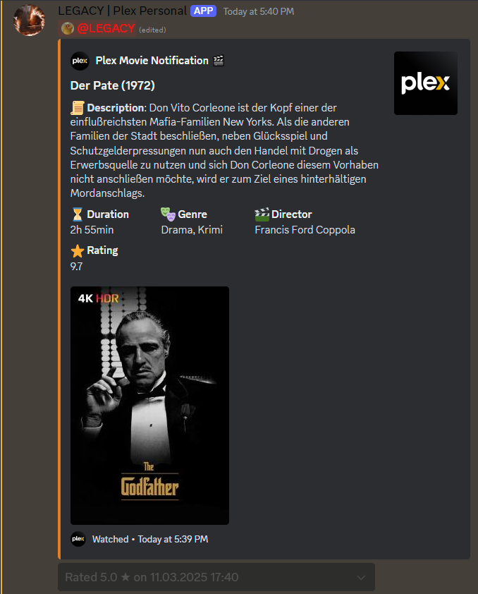
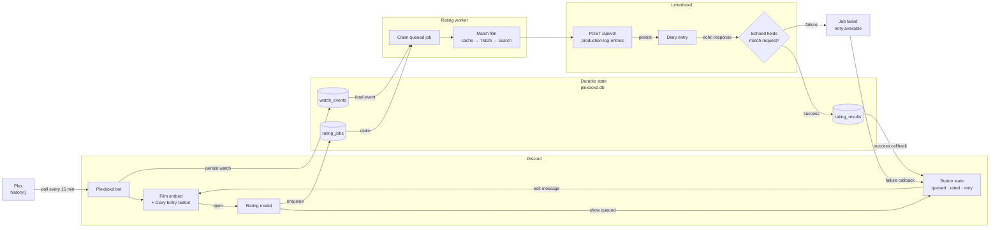
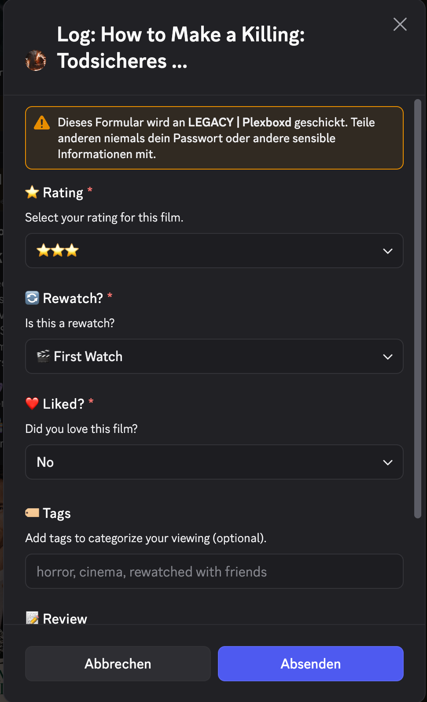

<div align="center">

# Plexboxd

**Rate the film you just watched on Plex from Discord — and have it land in your Letterboxd diary.**
Self-hosted Discord bot, SQLite job queue, no Letterboxd API key required.

[](https://github.com/nichtlegacy/plexboxd/releases/latest)
[](https://www.python.org/)
[](https://github.com/nichtlegacy/plexboxd/pkgs/container/plexboxd)
[](https://www.plex.tv)
[](https://letterboxd.com)
[](./LICENSE)

[Overview](#overview) • [Quick Start](#quick-start) • [Configuration](#configuration) • [Architecture](#architecture) • [Operations](#operations) • [Troubleshooting](#troubleshooting)




</div>

## Overview

Plexboxd watches your Plex server's playback history. When you finish a film, it posts a Discord
embed with poster, runtime, genres, director and library. One button opens a modal where you set
rating, rewatch, like, tags and a review — and the bot writes that diary entry to Letterboxd for you.

The write path is deliberate about two things:

- **Every rating is a durable job.** The modal enqueues a row in SQLite; a worker claims it, resolves
  the film, writes it, then verifies what Letterboxd echoed back. Nothing is reported as successful
  until the stored rating, like flag, rewatch flag and diary date all match what you asked for.
- **Only the login needs a browser.** Cloudflare challenges headless Chrome on `letterboxd.com`, so
  [Patchright](https://github.com/Kaliiiiiiiiii-Vinyzu/patchright) drives a real headful Chromium
  (against Xvfb in Docker) once, to mint the `cf_clearance` cookie. That session is persisted and
  reused, so a normal rating is a plain HTTP POST that takes a second or two with no browser launch.

## Features

- **Plex history monitoring** — polls `history()` every 15 minutes, filtered to your account, and
  correctly reports which library a film was actually played from
- **Rich Discord notifications** — poster attachment, duration, genres, director, rating, library, and
  view count plus previous watch date on rewatches
- **Timezone-correct timestamps** — the embed clock shows when the film was watched, not when the bot
  noticed it, and dates render in each viewer's own timezone and locale
- **Full diary entry modal** — rating in half-star steps, rewatch, like, tags and a 1000-character
  review, with rewatch pre-selected when the film is already in your history
- **Verified writes** — the response from Letterboxd is compared field by field against the request;
  a mismatch fails the job instead of silently recording a wrong rating
- **Durable job queue** — ratings survive restarts, are claimed by exactly one worker, and are
  inspectable and retryable from the CLI
- **Idempotent by design** — one watch event per `(rating_key, watched_at)`, one successful result per
  watch event, duplicate notifications suppressed across libraries
- **Film match caching** — TMDb redirect first, search fallback, and the resolved Letterboxd LID is
  cached so repeat ratings skip lookup entirely
- **Late-night date handling** — `DATE_THRESHOLD_HOUR` assigns a 03:00 finish to the previous day,
  judged on when you watched the film rather than when you rate it
- **Library exclusion** — keep 4K or Kids libraries out of your notifications
- **Live button state** — the button follows the job: `⏳ Sending to Letterboxd…`, `✅ Logged ★★★½`, or
  a red `🔁 Retry` on failure
- **Discord log forwarding** — optional webhook mirror of the bot log

## How It Works



1. **Detect.** Recently watched films (within 30 minutes, your account, not currently playing, not in
   an excluded library) become a `watch_event`, keyed on rating key plus watch timestamp.
2. **Notify.** An embed with a `📝 Diary Entry` button goes to `NOTIFY_CHANNEL_ID`, optionally
   mentioning `DISCORD_USER_ID`. The Discord message id is recorded so state can be restored after a
   restart.
3. **Queue.** The button opens a modal for rating, rewatch, like, tags and review. Submitting it
   enqueues a `rating_job` and confirms immediately — Discord never waits on Letterboxd.

   <div align="center">
     
   </div>

4. **Match.** The worker resolves the film via the cached LID, then `letterboxd.com/tmdb/<id>`, then
   film search. The base-62 LID from `/film/<slug>/json/` is what the write API needs; the numeric
   film id is rejected there.
5. **Write.** A single `POST /api/v0/production-log-entries` carries rating, like, rewatch, diary date,
   tags and review. If Cloudflare blocks it, the browser refreshes the session and the write is
   retried over HTTP; only if that fails too does the browser perform the write itself.
6. **Verify and report.** Rating, like, rewatch and diary date from the response are compared against
   the request. The button tracks the job throughout: `⏳ Sending to Letterboxd…`, then a green
   `✅ Logged ★★★½`, or a red `🔁 Retry` if the write failed.

## Requirements

| | |
|---|---|
| Python | 3.11 or newer (3.12 used in the image and CI) |
| Node.js | 18 or newer — runs Patchright for the Letterboxd login |
| Chromium | System Chromium or Chrome; headful, so a display or Xvfb is needed |
| Plex | Plex Media Server plus an auth token |
| Discord | A bot application, and admin rights on the target server |
| Letterboxd | Account username and password |

Docker covers Node, Chromium and Xvfb for you.

## Quick Start

### Docker Compose (recommended)

```bash
git clone https://github.com/nichtlegacy/plexboxd.git
cd plexboxd
cp .env.example .env
$EDITOR .env          # fill in the required values, see Configuration
mkdir -p data logs
docker compose up -d
docker compose logs -f
```

The bundled [docker-compose.yml](./docker-compose.yml) pulls `ghcr.io/nichtlegacy/plexboxd:latest`
and mounts `./data` and `./logs`.

A healthy first start logs roughly this, in order:

```
Running version: v1.3.0 | Latest Version: v1.3.0
Attempting Plex connection 1/7...
Plex connection established
Bot started as: YourBot#1234
Notification channel found: #plex-notifications
Restoring dropdown menus for recent movies...
```

Then watch a film. Within 15 minutes an embed appears in your channel.

> **Keep `./data` mounted.** It holds `plexboxd.db`, the Letterboxd session cookies and the Chromium
> profile. Losing it means a fresh browser login on the next rating.

### Docker without Compose

```bash
docker run -d \
  --name plexboxd \
  --restart unless-stopped \
  --env-file .env \
  -v /path/to/plexboxd/data:/app/data \
  -v /path/to/plexboxd/logs:/app/logs \
  ghcr.io/nichtlegacy/plexboxd:latest
```

On Unraid, host paths are typically `/mnt/user/appdata/plexboxd/data` and `…/logs`.

### Local development

```bash
git clone https://github.com/nichtlegacy/plexboxd.git
cd plexboxd
python3 -m venv .venv && source .venv/bin/activate
pip install -r requirements.txt
npm install                     # Patchright, for the Letterboxd login
cp .env.example .env && $EDITOR .env
python3 src/plex_bot.py
```

On Linux without a desktop session, install `xvfb` — the browser login is headful and
[browser_fallback.py](./src/plexboxd/integrations/letterboxd/browser_fallback.py) will wrap Chromium
in `xvfb-run` automatically when no `DISPLAY` is set.

Verify the Letterboxd side on its own before relying on the bot:

```bash
python3 src/plexboxd_cli.py bootstrap-session   # logs in via browser, persists cookies
python3 src/plexboxd_cli.py verify-session      # confirms the session still works
```

## Configuration

All settings come from the environment, loaded from `.env` in the project root. Start from
[.env.example](./.env.example), which documents every variable inline.

Startup aborts with a named error if a required variable is missing, rather than failing later:

```
Configuration error: PLEX_TOKEN is not set. Check your .env file (see .env.example) or the container environment.
```

### Discord

| Variable | Required | Description |
|---|---|---|
| `DISCORD_TOKEN` | yes | Bot token from the [Discord Developer Portal](https://discord.com/developers/applications) |
| `NOTIFY_CHANNEL_ID` | yes | Channel that receives film notifications |
| `GUILD_ID` | yes | Your Discord server id |
| `DISCORD_USER_ID` | no | Mentioned in each notification |
| `DISCORD_LOGGING_WEBHOOK_URL` | no | Mirrors the bot log into a Discord channel |

### Plex

| Variable | Required | Description |
|---|---|---|
| `PLEX_SERVER_URL` | yes | e.g. `http://192.168.1.100:32400` |
| `PLEX_TOKEN` | yes | Plex auth token |
| `PLEX_USERNAME` | yes | Matched against Plex accounts so only your watches count |
| `EXCLUDED_LIBRARIES` | no | Comma-separated library names, e.g. `4K Movies,Kids Movies` |

### Letterboxd

| Variable | Default | Description |
|---|---|---|
| `LETTERBOXD_USERNAME` | — | Required |
| `LETTERBOXD_PASSWORD` | — | Required |
| `DATE_THRESHOLD_HOUR` | `7` | Watches finishing before this hour (in `TZ`) are logged as the previous day; `0` disables the shift |

### Letterboxd runtime and Cloudflare

Defaults are the verified configuration. Change these only when debugging.

| Variable | Default | Description |
|---|---|---|
| `LETTERBOXD_BROWSER_PACKAGE` | `patchright` | Node package driving Chromium |
| `LETTERBOXD_BROWSER_PROFILE_DIR` | `data/letterboxd-browser-profile` | Persistent Chromium profile; keep it inside the mounted `data/` |
| `LETTERBOXD_BROWSER_HEADLESS` | `false` | Leave off — Cloudflare challenges headless Chrome, and the bot warns if you enable it |
| `LETTERBOXD_BROWSER_AUTH` | `true` | Bootstrap and verify the session through the browser instead of HTTP login |
| `LETTERBOXD_BROWSER_FALLBACK` | `true` | Let the browser refresh the session, and write as a last resort, when an HTTP write is blocked |
| `LETTERBOXD_IMPERSONATE` | *(empty)* | `curl_cffi` profiles, tried in order. Empty means `chrome136,firefox135,safari184`. Do not use `chrome120` or the bare `chrome` alias — both get challenged |
| `LETTERBOXD_MAX_RETRIES` | `3` | Retries per Letterboxd operation |
| `LETTERBOXD_BASE_BACKOFF_SECONDS` | `5.0` | Base for exponential backoff with jitter |
| `LETTERBOXD_TIMEOUT_SECONDS` | `20` | HTTP and browser wait timeout |
| `LETTERBOXD_SESSION_FILE` | `data/letterboxd_cookies.json` | Persisted cookie bundle |
| `LETTERBOXD_BROWSER_CHANNEL` | *(auto)* | Chromium channel override; auto-detected from the executable |
| `CHROME_BIN` | *(auto)* | Explicit Chromium path when auto-detection fails |
| `PLEXBOXD_ROOT` | *(auto)* | Overrides the project root used to anchor `data/`, `logs/` and `node_modules/` |
| `PLEXBOXD_LOG_DIR` | `logs` | Log directory; relative paths are resolved from the project root |

### Getting the tokens

<details>
<summary><b>Discord bot token, channel id and guild id</b></summary>

1. Create an application at the [Discord Developer Portal](https://discord.com/developers/applications),
   add a bot, and copy the token into `DISCORD_TOKEN`.
2. Enable **Message Content Intent** under *Bot → Privileged Gateway Intents*.
3. Invite the bot with permission to view the channel, send messages and attach files.
4. Enable *User Settings → Advanced → Developer Mode*, then right-click your server for `GUILD_ID`,
   the target channel for `NOTIFY_CHANNEL_ID`, and your own profile for `DISCORD_USER_ID`.
</details>

<details>
<summary><b>Plex token</b></summary>

Open any library item in Plex Web, choose **Get Info → View XML**, and copy the `X-Plex-Token`
value from the URL.
</details>

## Architecture

Application code lives in [src/plexboxd/](./src/plexboxd/), split by layer. The Discord bot is the
only part that talks to Plex and Discord; everything about rating a film goes through the queue.

- **[domain/](./src/plexboxd/domain/)** — frozen dataclasses and enums. `RatingRequest` rejects
  anything outside 0.5–5.0 in half-star steps; `RatingJob.can_transition_to` is the single source of
  truth for the status machine.
- **[application/](./src/plexboxd/application/)** — services with no I/O of their own: watch ingest,
  job enqueue and claim, match resolution, and rating execution.
- **[integrations/letterboxd/](./src/plexboxd/integrations/letterboxd/)** — session provider
  (`curl_cffi` with browser impersonation), matcher, writer, verifier, and the Patchright browser
  client plus its [Node script](./src/plexboxd/integrations/letterboxd/scripts/letterboxd_browser.cjs).
- **[infrastructure/](./src/plexboxd/infrastructure/)** — SQLite connection, versioned migrations,
  repositories, the job worker, clock and id factories.
- **[interfaces/](./src/plexboxd/interfaces/)** — the CLI and the standalone worker entrypoint.

### Job lifecycle

In practice a job runs `pending → running → succeeded`, or `pending → running → failed` and back to
`pending` via `retry-job`. `RatingJob.can_transition_to` also permits `matched`, `manual_action` and
`cancelled` — those are declared for future use and no current code path sets them.

Claiming is a conditional `UPDATE … WHERE job_lock_owner IS NULL`, so two workers cannot take the same
job. `enqueue` returns the existing job if one is already active for that watch event, and raises
`RatingJobAlreadyCompletedError` once a successful result exists — rating the same film twice is a
no-op rather than a duplicate diary entry.

### Data model

Migrations under
[infrastructure/db/schema/](./src/plexboxd/infrastructure/db/schema/) apply automatically at startup
and are tracked in `schema_migrations`.

| Table | Purpose |
|---|---|
| `watch_events` | One row per watch, unique on `(plex_rating_key, watched_at)` |
| `notifications` | Discord channel/message ids and view state per watch event |
| `rating_jobs` | Queue rows: requested rating, like, rewatch, tags, review, status, lock owner |
| `rating_attempts` | One row per try, with match and write strategy, error type and message |
| `rating_results` | Successful diary entries, unique per watch event |
| `film_match_cache` | Resolved slug, numeric film id and base-62 LID, keyed on TMDb id |
| `match_candidates` | Reserved for per-attempt search candidates; created by the schema, not yet written |

Two databases live in `data/`: **`plexboxd.db`** holds the tables above, and **`movies.db`** holds the
Plex-side film cache and notification state used for rewatch detection. A pre-1.1
`data/movie_data.json` is migrated into `movies.db` on first start and renamed to `.backup`.

## Operations

The CLI works against the same database as the bot and can run while it is up.

```bash
python3 src/plexboxd_cli.py list-failed-jobs             # every failed job as JSON
python3 src/plexboxd_cli.py inspect-job <job-id>         # one job in full
python3 src/plexboxd_cli.py retry-job <job-id>           # back to pending
python3 src/plexboxd_cli.py verify-session               # is the Letterboxd session alive?
python3 src/plexboxd_cli.py bootstrap-session            # force a fresh browser login
```

Test the whole match-and-write path against a real watch event, without Discord:

```bash
# resolve the film only, write nothing
python3 src/plexboxd_cli.py smoke-write --watch-event-id <id> --rating 4 --dry-run

# actually write a diary entry
python3 src/plexboxd_cli.py smoke-write \
  --watch-event-id <id> --rating 4.5 --liked --tags "horror, rewatch" --review "Held up."
```

Drain one queued job with a standalone worker — useful in a cron job or when the bot is down:

```bash
python3 src/plexboxd_worker.py --worker-id ops-box
```

Both default to `data/plexboxd.db`, resolved against the project root rather than the working
directory, so they find the bot's database from anywhere — including inside the container:

```bash
docker compose exec plexboxd python3 plexboxd_cli.py list-failed-jobs
```

Pass `--db-path` to point at a different database.

### Logging

Two log files, both rotating at midnight UTC and keeping 7 days:

| File | Contents |
|---|---|
| `plex_bot.log` | Startup and version check, Plex connection, film detection, notifications, queue activity |
| `letterboxd_integration.log` | Session bootstrap, film matching, diary writes and their failures |

Both are written to `logs/` next to `data/` — in the container that is the `/app/logs` mount,
regardless of the working directory. Set `PLEXBOXD_LOG_DIR` to relocate them. Everything also goes to
stdout, so `docker compose logs -f` shows the same lines.

Set `DISCORD_LOGGING_WEBHOOK_URL` to mirror both logs into a channel, colour-coded by level.

### Tests

```bash
python3 -m pytest
python3 -m pytest tests/unit     # domain, services, config, Letterboxd runtime
```

[tests/](./tests/) splits into unit tests for the domain, services and Letterboxd runtime, and
integration tests covering the schema, job claiming, worker lifecycle and CLI. Everything is
offline — no Plex, Discord or Letterboxd access needed.
[build-docker-image.yaml](./.github/workflows/build-docker-image.yaml) runs the suite and gates the
image publish on it, so a failing commit on `main` never reaches `:latest`.

## Project Structure

```
plexboxd
├─ src/
│  ├─ plex_bot.py                  # Discord bot, Plex monitor, embed dispatch
│  ├─ views.py                     # Diary entry button and modal
│  ├─ utils.py                     # Embed construction
│  ├─ logging_config.py            # Discord webhook log handler
│  ├─ plexboxd_cli.py              # → plexboxd.interfaces.cli
│  ├─ plexboxd_worker.py           # → plexboxd.interfaces.worker
│  └─ plexboxd/
│     ├─ domain/                   # Models, enums, status machine
│     ├─ application/              # Ingest, queue, matching, execution
│     ├─ integrations/letterboxd/  # Session, matcher, writer, verifier, browser
│     ├─ infrastructure/           # SQLite, migrations, repositories, worker
│     └─ interfaces/               # CLI and worker entrypoints
├─ tests/                          # Unit and integration tests
├─ data/                           # Databases, cookies, browser profile (mounted)
├─ logs/                           # Rotating log files
├─ Dockerfile                      # Python 3.12 + Chromium + Xvfb + Node
├─ entrypoint.sh                   # Starts Xvfb, waits for the display, runs the bot
└─ .env.example                    # Every setting, documented inline
```

## Troubleshooting

<details>
<summary><b>The bot cannot connect to Plex</b></summary>

It retries 7 times, 30 seconds apart, then exits. Check `PLEX_SERVER_URL` (including the `:32400`
port) and `PLEX_TOKEN`, confirm the container can reach the server, and use the LAN IP rather than
`localhost` when Plex runs on a different host.
</details>

<details>
<summary><b>No notifications appear</b></summary>

Films are skipped when they were watched more than 30 minutes ago, are still playing, belong to
`EXCLUDED_LIBRARIES`, were watched by another account, or were already notified within the last 30
minutes. `PLEX_USERNAME` must match the Plex account name or display name exactly — a mismatch means
nothing is ever attributed to you. Also confirm `NOTIFY_CHANNEL_ID` and that the bot can see the
channel and attach files. Polling is every 15 minutes, so allow a cycle.
</details>

<details>
<summary><b>Ratings stay queued or the button turns red</b></summary>

Find the cause, then retry:

```bash
python3 src/plexboxd_cli.py list-failed-jobs
```

`error_type` on the attempt tells you where it broke:

| `error_type` | Meaning |
|---|---|
| `challenge_detected` | Cloudflare blocked the request — run `bootstrap-session` |
| `auth_failed` | Letterboxd credentials rejected |
| `match_not_found` | The film could not be resolved on Letterboxd |
| `write_rejected` | Letterboxd refused the write, `error_message` has its reason |
| `verification_failed` | The entry was created with different values than requested |
| `unknown` | Anything else; see `error_message` |

Fix the cause, then `retry-job <id>`.
</details>

<details>
<summary><b>Letterboxd login fails</b></summary>

The login needs a real headful Chromium. Leave `LETTERBOXD_BROWSER_HEADLESS` at `false`, make sure
`npm install` has run so `node_modules/patchright` exists, and confirm Chromium is present — set
`CHROME_BIN` if auto-detection fails. On a headless Linux host install `xvfb`. In Docker the
entrypoint starts Xvfb and logs `display :99 not ready; continuing without it` when it could not.
Keep `./data` mounted so the profile and cookies survive restarts.
</details>

<details>
<summary><b>A film is matched to the wrong entry</b></summary>

Matching prefers the TMDb redirect, so a wrong or missing TMDb id in Plex is the usual cause — fix
the metadata in Plex, then delete the stale `film_match_cache` row so it re-resolves. Check what the
matcher picks without writing anything:

```bash
python3 src/plexboxd_cli.py smoke-write --watch-event-id <id> --rating 4 --dry-run
```
</details>

## Security Notes

`.env` holds your Discord bot token, Plex token and Letterboxd password in plain text, and `data/`
holds a live Letterboxd session plus a Chromium profile. Both are gitignored — keep them that way,
and do not commit or copy them into an image. `.dockerignore` excludes `data/` for the same reason.

## Acknowledgements

- [Plex](https://www.plex.tv) and [python-plexapi](https://github.com/pkkid/python-plexapi) — media
  server and the client library used for history and metadata
- [Letterboxd](https://letterboxd.com) — the diary this project writes to
- [discord.py](https://github.com/Rapptz/discord.py) — embeds, buttons and modals
- [curl_cffi](https://github.com/lexiforest/curl_cffi) — browser-impersonating HTTP client for film
  lookups and diary writes
- [Patchright](https://github.com/Kaliiiiiiiiii-Vinyzu/patchright) — drives the Chromium session that
  mints the Cloudflare clearance cookie

## Disclaimer

Independent third-party project, not affiliated with or endorsed by Plex, Letterboxd or Discord.
Letterboxd has no public write API, so this bot uses the same endpoints the website does; those can
change without notice. Use it at your own risk, keep request volume reasonable, and be aware that
automating an account may conflict with the service's terms.

## License

Released under the [MIT License](./LICENSE).
